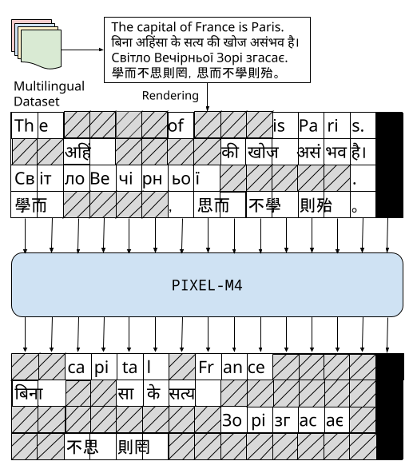

# PIXEL-M4

This repository contains code for **PIXEL-M4** proposed in _Multilingual Pretraining for Pixel Language Models_. PIXEL-M4 is a multilingual PIXEL model pretrained on four visually and linguistically diverse languages: English, Hindi, Ukrainian and Simplified Chinese. PIXEL-M4 shares the same architecture and set of hyperparameters with PIXEL, but pretrained on four languages using the improved bigrams rendering strategy. For more details about PIXEL-M4, please have a look at our paper [Multilingual Pretraining for Pixel Language Models](https://arxiv.org/abs/2505.21265). Information on how to cite our work can be found at the bottom.

**Disclaimer**: This codebase is a fork of [the original PIXEL codebase](https://github.com/xplip/pixel). So, PIXEL-M4 repository directly inherits code and documentation from the original upstream codebase.

<p align="left">
  
</p>

PIXEL-M4 consists of three major components: a text renderer, which draws text as an image; an encoder, which encodes the unmasked regions of the rendered image; and a decoder, which reconstructs the masked regions at the pixel level. It is built on [ViT-MAE](https://arxiv.org/abs/2111.06377).

During pretraining, the renderer produces images containing the training sentences. Patches of these images are linearly projected to obtain patch embeddings (as opposed to having an embedding matrix like e.g. in BERT), and 25% of the patches are masked out. The encoder, which is a Vision Transformer (ViT), then only processes the unmasked patches. The lightweight decoder with hidden size 512 and 8 transformer layers inserts learnable mask tokens into the encoder's output sequence and learns to reconstruct the raw pixel values at the masked positions.

After pretraining, the decoder can be discarded leaving an 86M parameter encoder, upon which task-specific classification heads can be stacked. Alternatively, the decoder can be retained and PIXEL can be used as a pixel-level generative language model (see Figures 3 and 6 in the paper for examples).

## Setup

This codebase extends the original [PIXEL](https://github.com/xplip/pixel) codebase [Transformers](https://github.com/huggingface/transformers) for PyTorch. The default font `GoNotoCurrent.ttf` that we used for all experiments is a merged Noto font built with [go-noto-universal](https://github.com/satbyy/go-noto-universal).

You can set up this codebase as follows to get started with using PIXEL-M4:

<details>
  <summary><i>Show Instructions</i></summary>
&nbsp;

1. Clone repo and initialize submodules
```
git clone https://github.com/ilkerkesen/pixel-m4.git
cd pixel-m4
```

2. Create a clone of the original environment using exported environment file,
```
conda env create -f environment.yml
conda activate pixel-m4
pip install -e .
```

Note that, this environment only supports systems with CUDA. If you want to use PIXEL-M4, you need to install non-CUDA PyTorch packages with the same version numbers.

3. Verify Installation on Japanese Dependency Parsing
```bash
# Create a folder in which we keep the data
mkdir -p data
# Get and extract the UD data for parsing and POS tagging
wget -c https://lindat.mff.cuni.cz/repository/xmlui/bitstream/handle/11234/1-4758/ud-treebanks-v2.10.tgz
tar xvf ud-treebanks-v2.10.tgz -C data

# treebank, directories and hyperparameters
TREEBANK="UD_Japanese-GSD"
DATA_DIR="./data/ud-treebanks-v2.10/${TREEBANK}"
FALLBACK_FONTS_DIR="./fallback_fonts_dir"
SEED=0
LR=1e-5

python ./scripts/training/run_ud_bigrams.py \
	--model_name_or_path="Team-PIXEL/pixel-m4" \
	--remove_unused_columns=False \
	--data_dir=${DATA_DIR} \
	--do_train --do_eval --do_predict \
	--dropout_prob=0.1 \
	--max_seq_length=256 \
	--max_steps=15000 \
	--early_stopping \
	--early_stopping_patience=5 \
	--per_device_train_batch_size=64 \
	--gradient_accumulation_steps=1 \
	--learning_rate=${LR} \
	--warmup_steps=100 \
	--run_name="pixel-m4--debug" \
	--output_dir=./debug/pixel-m4/udp/${TREEBANK}/${LR}--${SEED} \
	--overwrite_output_dir \
	--overwrite_cache \
	--logging_strategy=steps \
	--logging_steps=100 \
	--evaluation_strategy=steps \
	--eval_steps=500 \
	--save_strategy=steps \
	--save_steps=500 \
	--save_total_limit=2 \
	--report_to=none \
	--log_predictions \
	--load_best_model_at_end=True \
	--metric_for_best_model="eval_las" \
	--bf16 \
	--half_precision_backend=cuda_amp \
	--fallback_fonts_dir=${FALLBACK_FONTS_DIR} \
	--seed=0 \
	--dataloader_num_workers=8 \
	--rendering_backend="pangocairo"
```

If everything is configured correctly, you should expect to see results similar to the following:

```bash
***** test metrics *****
  test_las              =   90.8777
  test_loss             =   0.8192
```

Note that, we strongly recommend a complete finetuning for verifing the installation to have a reproducible environment in better conditions.
The results may vary from one GPU architecture to another. The above results are specifically produced on `NVIDIA RTX A4500` machines.
</details>

## Pretraining PIXEL

We provide instructions for pretraining PIXEL in [PRETRAINING.md](.github/PRETRAINING.md).

You can find our pretrained PIXEL-M4 at [https://huggingface.co/Team-PIXEL/pixel-m4](https://huggingface.co/Team-PIXEL/pixel-m4).

## Finetuning PIXEL

We provide instructions for finetuning PIXEL in [FINETUNING.md](.github/FINETUNING.md). If you follow our training recipes or simply evaluate using the models we provide via the links below, you can expect similar results as below.

## Reproducibility

We observed varying results for different versions of PyTorch, CUDA, HuggingFace Transformers and Pango/Cairo packages.
So, to reproduce results reported in the paper, we strongly recommend setting up the environment using `environment.yml` file.
Importantly, we repeated the same experiment for eight times using different seeds (list of seeds: 0,1,2,3,4,5,6,7).

## Citation & Contact

```bibtex
@article{kesen-etal-2025-multilingual,
  title={Multilingual Pretraining for Pixel Language Models},
  author={Ilker Kesen and Jonas F. Lotz and Ingo Ziegler and Phillip Rust and Desmond Elliott},
  journal={arXiv preprint},
  year={2025},
  url={https://arxiv.org/abs/2505.21265}
}
```

Feel free to open an issue here or send an email to ask questions about PIXEL-M4 or report problems with the code! We emphasize that this is experimental research code.

**Contact:**
Ilker Kesen (ilke--at--di.ku.dk)
